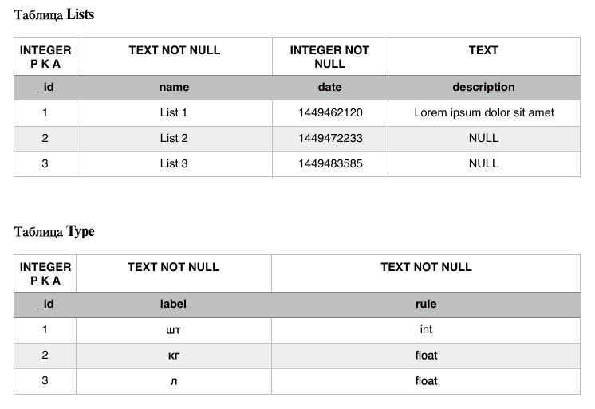
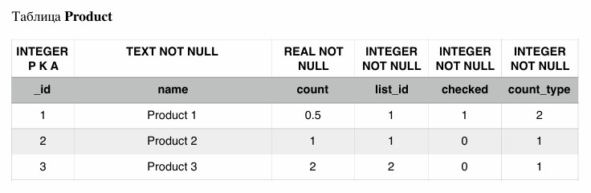

# Курс: «Разработка приложений под мобильные устройства на основе Android»

## Тема: Использование баз данных в Android-приложениях

---

### Задание 1:
**Спроектировать и разработать базу данных приложения «Список покупок», на основании указанных данных:**

- Таблица `Lists`: содержит списки покупок.
- Таблица `Type`: единицы измерения и типы данных.
- Таблица `Product`: товары, относящиеся к конкретным спискам.

### Задание 2:
**Создать Контент-провайдер.**

Определить методы для:
- создания,
- получения,
- удаления,
- изменения

следующих сущностей:
- списков (`Lists`),
- продуктов (`Product`),
- типов (`Type`).
